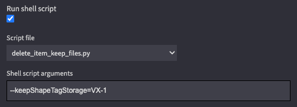

# Rules Engine 3 Scripts

This directory contains scripts that can be used in Portal Rules Engine 3

Please note that while fully functional, these scripts are provided as examples without further guarantees.

## Installation

* From Portal UI, Admin > Rules Engine 3 > Add a new script
* Select one of the files from your computer, and Upload
* Create a rule, for example Manual Process, or one triggered by a Saved Search
* in Create Rule, select Run shell script and select the script filename from the dropdown

## List of scripts

* `recreate_thumbnails.py`: Rules Engine 3 script to recreate Thumbnails on a video/image item.

* `delete_item_keep_files.py`: Rules Engine 3 script to delete an item but keep its files on
  storages. Supports arguments for more granular control.

Example creating a rule with delete_item_keep_files.py keeping files on storage VX-1 but deleting from other storages:

